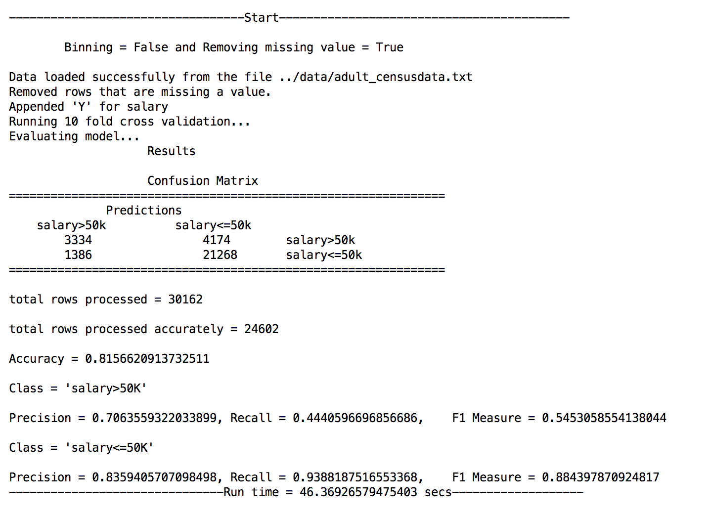

# Introduction
This repository is an implmentation of Naive Bayes algorithm in Python for the data set provided in the folder "data".
The data was downloaded from the the link http://archive.ics.uci.edu/ml/datasets/Adult, courtsey of the authors of the dataset.
Clone the repo and run the main.py file to see the Naive Bayes analysis of the dataset. 

# Sample Output

